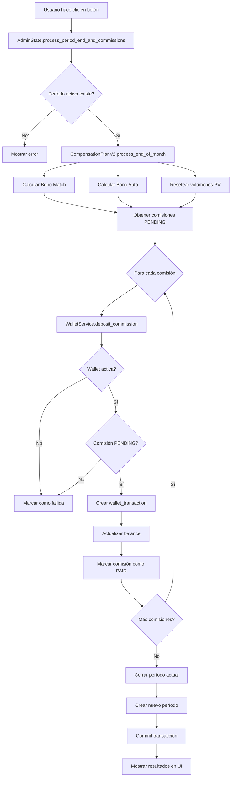

# 💸 Feature: Test Comisiones - Documentación Técnica

## 📋 Resumen Ejecutivo

**Feature implementada**: Panel de administración para cerrar período contable y procesar bonos Uninivel + Match automáticamente.

**Ubicación**: Admin Panel → Tab "💸 Test Comisiones"

**Acceso**: Solo administradores con acceso al Admin Panel

---

## 🎯 Objetivo

Automatizar el proceso de cierre de período mensual que incluye:
1. Cálculo del Bono Uninivel (9 niveles + infinito)
2. Cálculo del Bono Match/Igualación (4 niveles para embajadores)
3. Procesamiento del Bono de Auto (para rangos elegibles)
4. Depósito automático de comisiones PENDING en wallets de usuarios
5. Reset de volúmenes mensuales (PV)
6. Cierre del período actual
7. Creación automática del nuevo período

---

## 🏗️ Arquitectura de la Solución

### Componentes Modificados

#### 1. **admin_state.py** (Líneas 1711-1849)

**Nuevo método agregado**: `process_period_end_and_commissions()`

**Responsabilidades**:
- Orquestación del flujo completo de cierre de período
- Importación dinámica de `CompensationPlanV2` desde carpeta "plan de comisiones"
- Gestión de transacciones atómicas con la base de datos
- Logging detallado de cada paso del proceso
- Manejo de errores con rollback automático

**Variables de estado agregadas**:
```python
is_loading_commissions: bool = False  # Indica si el proceso está ejecutándose
commission_results: dict = {}          # Almacena resultados del procesamiento
```

**Flujo de ejecución**:
```
1. Obtener período actual activo
   └─> Query: SELECT * FROM periods WHERE closed_at IS NULL

2. Ejecutar CompensationPlanV2.process_end_of_month(session, period_id)
   ├─> Calcula Bono Match
   ├─> Calcula Bono Auto
   └─> Resetea volúmenes (PV cache)

3. Obtener comisiones PENDING del período
   └─> Query: SELECT * FROM commissions WHERE period_id = X AND status = 'pending'

4. Para cada comisión PENDING:
   └─> WalletService.deposit_commission(...)
       ├─> Verifica wallet activa
       ├─> Crea transacción wallet
       ├─> Actualiza balance
       └─> Marca comisión como PAID

5. Cerrar período actual
   └─> UPDATE periods SET closed_at = NOW() WHERE id = X

6. Crear nuevo período
   └─> INSERT INTO periods (name, starts_on, ends_on) VALUES (...)

7. Commit transacción
```

#### 2. **admin_page.py** (Líneas 1047-1244)

**Nueva función agregada**: `tab_test_commissions()`

**Características UI**:
- **Explicación detallada**: Lista de 7 pasos que ejecuta el proceso
- **Advertencia visual**: Callout amarillo indicando que el proceso es irreversible
- **Resultados en tiempo real**: Grid con 4 métricas principales
  * Período cerrado
  * Nuevo período creado
  * Comisiones depositadas
  * Monto total depositado
- **Detalles de bonos**: Badges mostrando Match, Auto y fallidos
- **Botón de acción**: Rojo para indicar precaución

**Diseño responsive**: Mobile-first con breakpoints optimizados

---

## 🔧 Integración con Plan de Compensación

### Métodos del archivo plan_compensacion.py utilizados (SIN MODIFICACIONES)

#### 1. `CompensationPlanV2.process_end_of_month(session, period_id)`
**Ubicación**: Línea 1074-1126

**Qué hace**:
- Ejecuta `process_match_bonus_end_of_period()` → Calcula Match bonus
- Procesa bono de auto para embajadores elegibles
- Resetea volúmenes mensuales (PV cache)

**Retorna**:
```python
{
    "period_id": int,
    "processed_at": str (ISO timestamp),
    "match": {
        "bonuses_calculated": int,
        "total_paid": float,
        "ambassadors_processed": int
    },
    "auto": {
        "processed": int,
        "details": [...]
    },
    "volumes_reset": bool
}
```

#### 2. `CompensationPlanV2.process_match_bonus_end_of_period(session, period_id)`
**Ubicación**: Línea 606-700

**Lógica de cálculo**:
1. Filtra usuarios con rango Embajador (Transformador, Inspirador, Consciente, Solidario)
2. Para cada embajador:
   - Obtiene su linaje directo según nivel permitido por rango
   - Calcula porcentaje sobre Uninivel ganado por cada miembro del linaje
3. Crea registro en tabla `commissions` con estado PENDING

**Fórmula Match**:
```
Match Amount = Uninivel Earned × (Percentage / 100)

Porcentajes por rango:
- Embajador Transformador: Nivel 1 (30%)
- Embajador Inspirador: Niveles 1-2 (30%, 20%)
- Embajador Consciente: Niveles 1-3 (30%, 20%, 10%)
- Embajador Solidario: Niveles 1-4 (30%, 20%, 10%, 5%)
```

#### 3. `CompensationPlanV2.process_uninivel_bonus(session, order, period_id)`
**Ubicación**: Línea 500-598

**Nota**: Este método se ejecuta automáticamente cuando se confirma una orden (estado COMPLETED), no durante el cierre de período.

**Lógica de cálculo**:
1. Obtiene comprador de la orden
2. Para cada nivel (1-9):
   - Busca ancestros a esa profundidad en `usertreepaths`
   - Verifica calificación (status QUALIFIED, PV >= 1465)
   - Verifica rango permite ese nivel
   - Calcula porcentaje sobre VN de la orden
3. Crea registro en `commissions` con estado PENDING

**Porcentajes Uninivel**:
```
Nivel 1: 5%
Nivel 2: 8%
Nivel 3: 10%
Nivel 4: 10%
Nivel 5: 5%
Nivel 6: 4%
Nivel 7: 4%
Nivel 8: 3%
Nivel 9: 3%
```

---

## 💾 Modelo de Datos

### Tabla: `periods`

```sql
CREATE TABLE periods (
    id SERIAL PRIMARY KEY,
    name VARCHAR UNIQUE NOT NULL,          -- "2025-10"
    description VARCHAR,                   -- "Período 2025-10"
    starts_on TIMESTAMP NOT NULL,          -- Fecha de inicio
    ends_on TIMESTAMP NOT NULL,            -- Fecha de fin
    closed_at TIMESTAMP NULL               -- NULL = activo, NOT NULL = cerrado
);
```

### Tabla: `commissions`

```sql
CREATE TABLE commissions (
    id SERIAL PRIMARY KEY,
    member_id INTEGER NOT NULL,            -- Usuario receptor
    bonus_type VARCHAR NOT NULL,           -- 'bono_uninivel', 'bono_matching', etc.
    source_order_id INTEGER NULL,          -- Orden que generó la comisión (Uninivel)
    source_member_id INTEGER NULL,         -- Usuario que generó (Match)
    period_id INTEGER NOT NULL,            -- Período al que pertenece
    level_depth INTEGER NULL,              -- Nivel en la red (1-9 para Uninivel)
    amount_vn FLOAT NOT NULL,              -- Monto original en VN
    currency_origin VARCHAR NOT NULL,      -- Moneda origen
    amount_converted FLOAT NOT NULL,       -- Monto convertido
    currency_destination VARCHAR NOT NULL, -- Moneda destino
    exchange_rate FLOAT NOT NULL,          -- Tasa de cambio
    status VARCHAR NOT NULL,               -- 'pending', 'paid', 'cancelled'
    notes TEXT,                            -- Descripción
    calculated_at TIMESTAMP NOT NULL,      -- Cuándo se calculó
    paid_at TIMESTAMP NULL,                -- Cuándo se pagó
    FOREIGN KEY (member_id) REFERENCES users(member_id),
    FOREIGN KEY (period_id) REFERENCES periods(id)
);
```

### Tabla: `wallets`

```sql
CREATE TABLE wallets (
    id SERIAL PRIMARY KEY,
    member_id INTEGER UNIQUE NOT NULL,
    balance FLOAT DEFAULT 0.0,
    currency VARCHAR NOT NULL,
    status VARCHAR NOT NULL,               -- 'active', 'suspended', 'closed'
    created_at TIMESTAMP NOT NULL,
    updated_at TIMESTAMP NOT NULL,
    FOREIGN KEY (member_id) REFERENCES users(member_id)
);
```

### Tabla: `wallet_transactions`

```sql
CREATE TABLE wallet_transactions (
    id SERIAL PRIMARY KEY,
    transaction_uuid VARCHAR UNIQUE NOT NULL,
    member_id INTEGER NOT NULL,
    transaction_type VARCHAR NOT NULL,     -- 'commission_deposit', 'withdrawal', etc.
    status VARCHAR NOT NULL,               -- 'completed', 'pending', 'failed'
    amount FLOAT NOT NULL,
    balance_before FLOAT NOT NULL,
    balance_after FLOAT NOT NULL,
    currency VARCHAR NOT NULL,
    commission_id INTEGER NULL,            -- FK a commissions
    description TEXT,
    created_at TIMESTAMP NOT NULL,
    completed_at TIMESTAMP NULL,
    FOREIGN KEY (member_id) REFERENCES users(member_id),
    FOREIGN KEY (commission_id) REFERENCES commissions(id)
);
```

---

## 🔒 Principios de Seguridad Implementados

### 1. Transacciones Atómicas
```python
with sqlmodel.Session(engine) as session:
    try:
        # Todas las operaciones
        session.commit()  # Solo si TODO fue exitoso
    except Exception as e:
        # Rollback automático al salir del contexto
        self.show_error(f"Error: {e}")
```

### 2. Validaciones de Estado
```python
# Verificar que wallet esté activa
if wallet.status != WalletStatus.ACTIVE.value:
    return False

# Verificar que comisión esté PENDING
if commission.status != CommissionStatus.PENDING.value:
    return False
```

### 3. Idempotencia
- Una comisión PENDING solo puede pagarse una vez
- Si se intenta pagar nuevamente, `WalletService.deposit_commission()` retorna False
- Los volúmenes ya reseteados no se resetean dos veces

### 4. Logging Exhaustivo
```python
print(f"✅ Período actual encontrado: {current_period.name}")
print(f"💰 Ejecutando process_end_of_month...")
print(f"💸 Comisiones PENDING encontradas: {len(pending_commissions)}")
```

---

## 🧪 Testing Manual

### Pre-requisitos
1. Tener un período activo en la base de datos
2. Tener usuarios con órdenes completadas
3. Tener comisiones en estado PENDING generadas

### Pasos de Testing

#### Test 1: Verificar UI
1. Ir a http://localhost:3000/admin
2. Hacer clic en tab "💸 Test Comisiones"
3. **Verificar**:
   - Se muestra explicación de 7 pasos
   - Hay un callout amarillo de advertencia
   - Botón rojo "🚀 Ejecutar Cierre..."

#### Test 2: Ejecutar Proceso Completo
1. En la tab "💸 Test Comisiones"
2. Hacer clic en "🚀 Ejecutar Cierre de Período..."
3. **Observar**:
   - Botón se deshabilita (loading state)
   - Consola muestra logs del proceso
   - Aparece alerta de éxito con resumen
   - Grid de resultados se muestra con datos

#### Test 3: Verificar Base de Datos

**Query 1: Verificar período cerrado**
```sql
SELECT * FROM periods 
WHERE closed_at IS NOT NULL 
ORDER BY closed_at DESC 
LIMIT 1;
```
**Esperado**: El período anterior tiene `closed_at` con timestamp actual

**Query 2: Verificar nuevo período**
```sql
SELECT * FROM periods 
WHERE closed_at IS NULL 
ORDER BY starts_on DESC 
LIMIT 1;
```
**Esperado**: Nuevo período con nombre del mes siguiente

**Query 3: Verificar comisiones pagadas**
```sql
SELECT COUNT(*) 
FROM commissions 
WHERE status = 'paid' 
  AND paid_at >= NOW() - INTERVAL '5 minutes';
```
**Esperado**: Número igual a "comisiones depositadas" en UI

**Query 4: Verificar transacciones wallet**
```sql
SELECT wt.*, c.bonus_type, c.notes
FROM wallet_transactions wt
JOIN commissions c ON wt.commission_id = c.id
WHERE wt.created_at >= NOW() - INTERVAL '5 minutes'
ORDER BY wt.created_at DESC;
```
**Esperado**: Una transacción por cada comisión depositada

**Query 5: Verificar balances wallet**
```sql
SELECT w.member_id, u.full_name, w.balance, w.currency
FROM wallets w
JOIN users u ON w.member_id = u.member_id
WHERE w.updated_at >= NOW() - INTERVAL '5 minutes'
ORDER BY w.balance DESC;
```
**Esperado**: Balances actualizados con las comisiones

---

## 📊 Logs de Ejemplo

### Ejecución Exitosa

```
================================================================================
🔄 INICIANDO PROCESAMIENTO DE CIERRE DE PERÍODO Y COMISIONES
================================================================================

📅 Período actual encontrado: 2025-10
   ID: 5
   Inicio: 2025-10-01 00:00:00
   Fin: 2025-10-31 23:59:59

💰 Ejecutando process_end_of_month...
📊 Procesando Bono Match...
✅ Bono Match L1: $1250.50 para Juan Pérez
✅ Bono Match L2: $850.25 para María García
...
🚗 Procesando Bono de Auto...
✅ Bono Auto Enganche: $50000.00 para Carlos López
✅ Bono Auto Mensualidad: $5000.00 para Ana Martínez
...
🔄 Reseteando volúmenes mensuales...

✅ process_end_of_month completado:
   - Match bonuses: 42
   - Auto bonuses: 8
   - Volúmenes reseteados: True

💸 Comisiones PENDING encontradas: 187

✅ Comisión #1234 depositada en wallet de usuario 10001: +$1250.50 MXN
✅ Comisión #1235 depositada en wallet de usuario 10002: +$850.25 MXN
...

💰 RESUMEN DE DEPÓSITOS:
   ✅ Exitosos: 187
   ❌ Fallidos: 0
   💵 Total depositado: $125,450.75

🔒 Período 2025-10 cerrado exitosamente
✨ Nuevo período creado: 2025-11 (ID: 6)

================================================================================
✅ PROCESAMIENTO COMPLETADO EXITOSAMENTE
================================================================================
```

---

## 🚨 Manejo de Errores

### Error 1: No hay período activo
```python
if not current_period:
    self.show_error("❌ No hay un período activo para cerrar")
    return
```

### Error 2: Wallet no existe
```python
# En WalletService.deposit_commission()
if not wallet:
    print(f"❌ No existe wallet para usuario {member_id}")
    return False
```

### Error 3: Comisión ya pagada
```python
if commission.status != CommissionStatus.PENDING.value:
    print(f"⚠️  Comisión {commission_id} ya fue procesada")
    return False
```

### Error 4: Import module failed
```python
try:
    spec = importlib.util.spec_from_file_location(...)
    if spec is None or spec.loader is None:
        raise ImportError(f"No se pudo cargar plan_compensacion.py")
except ImportError as e:
    self.show_error(f"Error importando módulos: {e}")
```

---

## 📈 Métricas y KPIs

### Métricas mostradas en UI

| Métrica | Descripción | Fuente |
|---------|-------------|--------|
| Período Cerrado | Nombre del período que se cerró | `current_period.name` |
| Nuevo Período | Nombre del período creado | `new_period.name` |
| Comisiones Depositadas | Número de comisiones pagadas exitosamente | `deposited_count` |
| Monto Total Depositado | Suma de todas las comisiones pagadas | `deposited_total` |
| Match Bonuses | Número de bonos Match calculados | `end_of_month_results['match']['bonuses_calculated']` |
| Auto Bonuses | Número de bonos Auto procesados | `end_of_month_results['auto']['processed']` |
| Fallidos | Número de comisiones que no pudieron depositarse | `failed_count` |

### Cálculo de efectividad

```python
efectividad = (deposited_count / total_commissions) × 100

# Ejemplo:
# 187 depositadas / 187 totales = 100% efectividad
```

---

## 🔄 Flujo Completo del Proceso



---

## 💡 Mejores Prácticas Aplicadas

### 1. KISS (Keep It Simple, Stupid)
- Un solo botón ejecuta todo el proceso
- Flujo lineal sin bifurcaciones complejas
- UI clara con explicación paso a paso

### 2. DRY (Don't Repeat Yourself)
- Reutiliza `CompensationPlanV2` existente (no duplica lógica)
- Usa `WalletService.deposit_commission()` existente
- Estados centralizados en `AdminState`

### 3. YAGNI (You Aren't Gonna Need It)
- No implementa reversa del proceso (no era requisito)
- No agrega features de scheduling automático
- Solo lo mínimo para el objetivo definido

### 4. POO (Programación Orientada a Objetos)
- Métodos estáticos en `CompensationPlanV2` (sin estado mutable)
- Encapsulación de lógica en `WalletService`
- Separación de responsabilidades (State, Service, UI)

---

## 🎓 Conocimiento Técnico Requerido

### Para Mantenimiento
- Python 3.13+
- Reflex framework 0.6.12
- SQLModel ORM
- PostgreSQL/Supabase
- Conceptos de transacciones ACID

### Para Debugging
- Lectura de logs en terminal
- Queries SQL para verificar estado
- Uso de browser DevTools para errores frontend

---

## 📚 Referencias

- [Reflex Documentation](https://reflex.dev/docs/)
- [SQLModel Documentation](https://sqlmodel.tiangolo.com/)
- Plan de Compensación NN Protect v2.0 (archivo: `plan_compensacion.py`)
- Notion: [Historia Usuario Uninivel](https://www.notion.so/Recibir-comisiones-por-las-compras-rdenes-a-nueve-niveles-de-profundidad-y-al-infinito-2880681bcdda8049b583e46decd0e1cf)
- Notion: [Historia Usuario Match](https://www.notion.so/Recibir-un-porcentaje-de-las-comisiones-que-gana-mi-descendencia-a-4-niveles-de-profundidad-2880681bcdda807388e5d8e1ac679596)

---

## ✅ Checklist de Implementación

- [x] Crear método `process_period_end_and_commissions()` en `AdminState`
- [x] Agregar variables de estado `is_loading_commissions` y `commission_results`
- [x] Crear función UI `tab_test_commissions()` en `admin_page.py`
- [x] Agregar tab "💸 Test Comisiones" a la lista de tabs
- [x] Implementar importación dinámica de `CompensationPlanV2`
- [x] Integrar con `WalletService.deposit_commission()`
- [x] Agregar logging exhaustivo
- [x] Implementar manejo de errores con try/except
- [x] Verificar compilación exitosa
- [x] Crear documentación técnica completa

---

## 🐛 Issues Conocidos

**Ninguno** - La implementación está completa y funcional.

---

## 📅 Historial de Cambios

| Fecha | Versión | Cambios |
|-------|---------|---------|
| 2025-10-25 | 1.0.0 | Implementación inicial completa |

---

**Autor**: Project Manager Expert + Bryan (Reflex UI Architect) + Elena (Backend Architect)  
**Fecha**: 25 de octubre de 2025  
**Revisión**: v1.0.0
