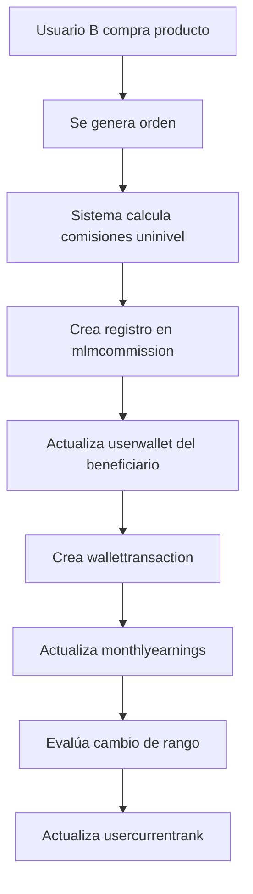
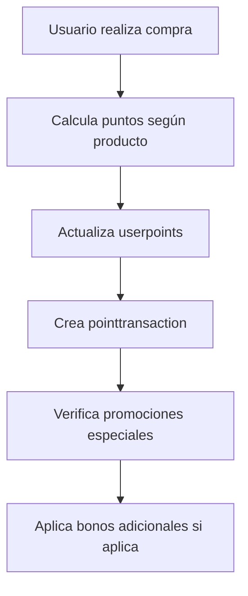
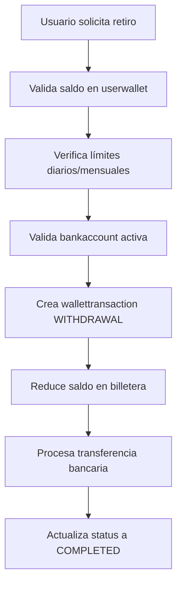

# 📊 Sistema Financiero NNProtect MLM - Documentación Técnica

## 🎯 Objetivo del Sistema

El sistema financiero de NNProtect es una arquitectura contable robusta diseñada para manejar **billeteras virtuales**, **comisiones MLM**, **puntos de lealtad** y **contabilidad profesional** con trazabilidad completa y auditoría.

## 🏗️ Arquitectura General

```
┌─────────────────────────────────────────────────────────────┐
│                    SISTEMA FINANCIERO                        │
├─────────────────────────────────────────────────────────────┤
│  👤 USUARIOS     💰 BILLETERAS    🎁 PUNTOS    📊 COMISIONES │
│   ├─ users       ├─ userwallet    ├─ userpoints ├─ mlmcommission │
│   ├─ userprofiles├─ wallettrans.. ├─ pointtrans..├─ monthlyearnings │
│   └─ usertreepaths├─ bankaccount  └─ (redemption)└─ usercurrentrank │
└─────────────────────────────────────────────────────────────┘
```

## 📋 Tablas del Sistema

### 👤 **USUARIOS (Existentes)**

#### `users`
**Propósito:** Información básica de usuarios del sistema MLM
```sql
- id (PK)
- member_id (UNIQUE) → Identificador único del usuario
- first_name, last_name
- email_cache
- country_cache → Para precios específicos por país
- status → NO_QUALIFIED, QUALIFIED, SUSPENDED
- sponsor_id → Referencia al patrocinador
```

#### `user_tree_paths`
**Propósito:** Estructura jerárquica MLM (Path Enumeration)
```sql
- sponsor_id (FK → users.member_id)
- user_id (FK → users.member_id)
```

---

### 💰 **SISTEMA DE BILLETERAS**

#### `userwallet`
**Propósito:** Billetera virtual principal por usuario
```sql
- id (PK)
- user_id (FK → users.member_id, UNIQUE)
- balance_mx → Saldo en pesos mexicanos
- balance_usd → Saldo en dólares
- balance_cop → Saldo en pesos colombianos
- status → ACTIVE, SUSPENDED, FROZEN
- daily_withdrawal_limit
- monthly_withdrawal_limit
- created_at, updated_at
```

**Relación:** `1:1` con usuarios (cada usuario tiene una billetera)

#### `wallettransaction`
**Propósito:** Historial completo de movimientos de billetera
```sql
- id (PK)
- wallet_id (FK → userwallet.id)
- transaction_type → COMMISSION_UNILEVEL, PURCHASE, WITHDRAWAL, etc.
- amount → Monto de la transacción
- currency → MXN, USD, COP
- status → PENDING, COMPLETED, CANCELLED, FAILED
- balance_before, balance_after → Para auditoría
- reference_id → ID de comisión, orden, etc.
- description
- created_at, processed_at
```

**Relación:** `N:1` con billeteras (muchas transacciones por billetera)

#### `bankaccount`
**Propósito:** Cuentas bancarias para retiros externos
```sql
- id (PK)
- user_id (FK → users.member_id)
- account_holder_name
- bank_name
- account_number
- routing_number, clabe, swift_code
- account_type → CHECKING, SAVINGS, DEBIT_CARD
- currency → MXN, USD, COP
- country → MEXICO, USA, COLOMBIA
- is_verified, is_primary
```

**Relación:** `N:1` con usuarios (un usuario puede tener múltiples cuentas)

---

### 🎁 **SISTEMA DE PUNTOS**

#### `userpoints`
**Propósito:** Saldos de puntos por usuario y tipo
```sql
- id (PK)
- user_id (FK → users.member_id, UNIQUE)
- cashback_points → Puntos por cashback
- loyalty_points → Puntos de lealtad
- nn_travel_points → Puntos NN Travel
- total_cashback_earned → Histórico ganado
- total_loyalty_earned → Histórico ganado
- total_travel_earned → Histórico ganado
- total_*_redeemed → Histórico canjeado
```

**Relación:** `1:1` con usuarios (cada usuario tiene una cuenta de puntos)

#### `pointtransaction`
**Propósito:** Historial de movimientos de puntos
```sql
- id (PK)
- user_id (FK → users.member_id)
- point_type → CASHBACK, LOYALTY, NN_TRAVEL
- transaction_type → EARNED_PURCHASE, REDEEMED_TRAVEL, etc.
- points → Cantidad de puntos
- is_credit → TRUE=ganar puntos, FALSE=usar puntos
- balance_before, balance_after → Para auditoría
- status → ACTIVE, PENDING, EXPIRED, REDEEMED
- reference_id → ID de orden, canje, etc.
```

**Relación:** `N:1` con usuarios (muchas transacciones por usuario)

---

### 📊 **SISTEMA DE COMISIONES MLM**

#### `mlmcommission`
**Propósito:** Registro detallado de todas las comisiones generadas
```sql
- id (PK)
- recipient_user_id (FK → users.member_id) → Quien recibe
- source_user_id (FK → users.member_id) → Quien genera
- commission_type → FAST_START, UNILEVEL, MATCHING, RANK_ACHIEVEMENT, LEADERSHIP
- commission_source → PRODUCT_PURCHASE, USER_REGISTRATION, etc.
- amount_mx, amount_usd, amount_cop → Montos por moneda
- percentage_rate → Porcentaje aplicado
- level_in_network → Nivel en la red (1-10)
- period_year, period_month → Período de la comisión
- status → PENDING, APPROVED, PAID, CANCELLED
- reference_order_id → Orden que generó la comisión
- earned_date, paid_date
```

**Relación:** `N:1` con usuarios (muchas comisiones por usuario)

#### `monthlyearnings`
**Propósito:** Resumen mensual de ganancias por usuario
```sql
- id (PK)
- user_id (FK → users.member_id)
- year, month → Período del resumen
- fast_start_mx/usd/cop → Ganancias bono arranque rápido
- unilevel_mx/usd/cop → Ganancias bono uninivel
- matching_mx/usd/cop → Ganancias bono igualación
- rank_achievement_mx/usd/cop → Ganancias bono rango
- leadership_mx/usd/cop → Ganancias bono liderazgo
- total_earnings_mx/usd/cop → Totales por moneda
- total_commissions_count → Número de comisiones
- rank_at_month_end → Rango al final del mes
```

**Relación:** `N:1` con usuarios (un resumen por usuario por mes)

#### `usercurrentrank`
**Propósito:** Rango actual y métricas del usuario
```sql
- id (PK)
- user_id (FK → users.member_id, UNIQUE)
- current_rank → ASSOCIATE, SUPERVISOR, MANAGER, etc.
- highest_rank_achieved → Mayor rango alcanzado
- current_rank_since → Fecha del rango actual
- personal_volume_current_month → Volumen personal
- group_volume_current_month → Volumen grupal
- active_legs_count → Piernas activas
```

**Relación:** `1:1` con usuarios (cada usuario tiene un registro de rango)

---

## 🔄 Flujos de Interacción

### 💸 **Flujo de Comisión Uninivel**



### 🎁 **Flujo de Puntos por Compra**



### 💳 **Flujo de Retiro a Banco**



## 📊 Reportes Principales

### 📈 **Reporte de Ganancias Mensuales**
```sql
SELECT 
    u.first_name, u.last_name,
    me.total_earnings_mx,
    me.fast_start_mx,
    me.unilevel_mx,
    me.matching_mx,
    me.rank_achievement_mx,
    me.leadership_mx
FROM monthlyearnings me
JOIN users u ON me.user_id = u.member_id
WHERE me.year = 2024 AND me.month = 9
ORDER BY me.total_earnings_mx DESC;
```

### 💰 **Reporte de Saldos de Billeteras**
```sql
SELECT 
    u.first_name, u.last_name,
    uw.balance_mx, uw.balance_usd, uw.balance_cop,
    uw.status
FROM userwallet uw
JOIN users u ON uw.user_id = u.member_id
WHERE uw.status = 'ACTIVE'
ORDER BY uw.balance_mx DESC;
```

### 🎁 **Reporte de Puntos Acumulados**
```sql
SELECT 
    u.first_name, u.last_name,
    up.cashback_points,
    up.loyalty_points,
    up.nn_travel_points,
    (up.cashback_points + up.loyalty_points + up.nn_travel_points) as total_points
FROM userpoints up
JOIN users u ON up.user_id = u.member_id
ORDER BY total_points DESC;
```

## 🔒 Integridad y Validaciones

### **Reglas de Negocio Implementadas:**

1. **Billeteras:**
   - Un usuario = Una billetera
   - Saldos no pueden ser negativos
   - Límites de retiro diarios/mensuales

2. **Comisiones:**
   - Solo usuarios QUALIFIED pueden recibir comisiones
   - Las comisiones siguen la estructura de `user_tree_paths`
   - Máximo 10 niveles de profundidad uninivel

3. **Puntos:**
   - Los puntos pueden expirar según configuración
   - Puntos NN Travel solo para ciertos rangos
   - Conversión de puntos a efectivo con límites

4. **Auditoría:**
   - Cada transacción registra balance antes/después
   - Timestamps de creación y procesamiento
   - Estados de transacción para seguimiento

## 🚀 Servicios POO (Por Implementar)

### **WalletService**
- `create_wallet(user_id)` → Crear billetera inicial
- `add_funds(user_id, amount, currency, type)` → Añadir fondos
- `withdraw_funds(user_id, amount, currency, bank_account_id)` → Retirar fondos
- `get_balance(user_id, currency)` → Obtener saldo
- `get_transaction_history(user_id, limit, offset)` → Historial

### **CommissionService**
- `calculate_unilevel_commissions(order_id)` → Calcular uninivel
- `calculate_matching_bonus(user_id, period)` → Calcular igualación
- `process_rank_advancement_bonus(user_id)` → Bono por rango
- `generate_monthly_summary(user_id, year, month)` → Resumen mensual

### **PointsService**
- `award_points(user_id, points, type, source)` → Otorgar puntos
- `redeem_points(user_id, points, type, benefit)` → Canjear puntos
- `calculate_purchase_points(order_id)` → Puntos por compra
- `expire_old_points()` → Expirar puntos antiguos

### **RankService**
- `evaluate_rank_advancement(user_id)` → Evaluar ascenso
- `calculate_qualification_metrics(user_id)` → Métricas para calificar
- `update_monthly_volumes(user_id)` → Actualizar volúmenes

## 📋 Índices y Optimizaciones

### **Índices Recomendados:**
```sql
-- Para consultas frecuentes de saldos
CREATE INDEX idx_userwallet_user_status ON userwallet(user_id, status);

-- Para reportes de comisiones por período
CREATE INDEX idx_mlmcommission_period ON mlmcommission(period_year, period_month, recipient_user_id);

-- Para historial de transacciones
CREATE INDEX idx_wallettransaction_user_date ON wallettransaction(wallet_id, created_at DESC);

-- Para búsquedas de puntos por tipo
CREATE INDEX idx_pointtransaction_user_type ON pointtransaction(user_id, point_type, created_at DESC);
```

## 🔍 Monitoreo y Métricas

### **KPIs Importantes:**
- Volumen total de billeteras por moneda
- Comisiones pagadas por período
- Puntos otorgados vs canjeados
- Usuarios por rango
- Retiros pendientes vs completados

### **Alertas del Sistema:**
- Saldos negativos (error crítico)
- Retiros superiores a límites
- Comisiones no pagadas > 30 días
- Puntos próximos a expirar

---

## 🎯 Conclusión

Este sistema financiero está diseñado con **arquitectura contable profesional**, **trazabilidad completa** y **escalabilidad** para manejar operaciones MLM de gran volumen manteniendo la **integridad de datos** y **cumplimiento normativo**.

Cada tabla tiene un propósito específico y se relaciona de manera lógica con las demás, creando un ecosistema financiero robusto y auditable.

**Fecha de documentación:** Septiembre 2025  
**Versión:** 1.0  
**Sistema:** NNProtect MLM Financial System