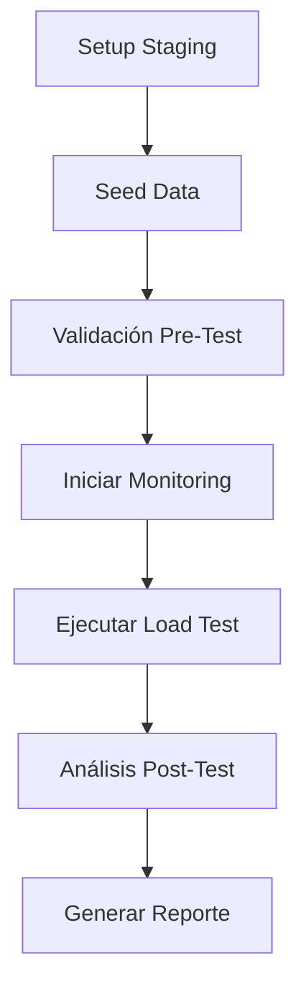

# NN-6: Load Testing con 100+ Pagos Concurrentes

**Ticket:** [NN-6](https://linear.app/nn-backoffice/issue/NN-6/load-testing-con-100-pagos-concurrentes)
**Branch:** `bnunez/nn-6-load-testing-con-100-pagos-concurrentes`
**Fecha:** 2025-10-02
**Estado:** ✅ Implementación Completa

---

## 📋 Resumen Ejecutivo

Se ha implementado un sistema completo de load testing para validar el rendimiento del servicio de pagos de NNProtect bajo condiciones de alta concurrencia (100+ transacciones simultáneas).

### Objetivos Cumplidos

✅ Sistema de load testing con Locust
✅ Ambiente staging aislado y seguro
✅ Scripts de seeding para 200 usuarios de prueba
✅ Monitoring en tiempo real de DB
✅ Validaciones pre y post-test automatizadas
✅ Documentación completa

---

## 🏗️ Arquitectura de la Solución

### Componentes Implementados

```
testers/load_testing/
├── seed_load_test_data.py       # Genera datos de prueba (member_id 80000-80199)
├── locustfile.py                # Script principal de Locust
├── monitor_load_test.py         # Monitoring en tiempo real
├── monitoring_queries.sql       # Queries SQL para análisis
├── validate_staging_env.sh      # Validación pre-test
├── post_test_analysis.sh        # Análisis post-test
├── alert_thresholds.py          # Umbrales de alerta
├── .env.staging.example         # Template de configuración
├── docker-compose.staging.yml   # PostgreSQL local opcional
└── README.md                    # Documentación completa
```

### Flujo de Trabajo



---

## 🔧 Configuración Técnica

### 1. Ambiente Staging

**Opción A: Supabase Staging (Recomendado)**
- Proyecto Supabase separado
- Base de datos PostgreSQL aislada
- Variables en `.env.staging`

**Opción B: PostgreSQL Local (Docker)**
- Docker Compose incluido
- Puerto 5433 (no conflicto con prod)
- Configuración optimizada para load testing

### 2. Usuarios de Prueba

- **Rango de IDs:** 80000 - 80199 (200 usuarios)
- **Wallets:** Balance inicial 5,000-10,000 MXN
- **Estructura MLM:** Todos patrocinados por user 80000
- **Status:** QUALIFIED

### 3. Connection Pool

```python
engine = sqlmodel.create_engine(
    DATABASE_URL,
    pool_size=20,
    max_overflow=40,
    pool_pre_ping=True
)
```

---

## 📊 Escenarios de Prueba

### Escenario 1: Carga Sostenida (Baseline)
- **Usuarios:** 100 concurrentes
- **Duración:** 10 minutos
- **Objetivo:** Establecer baseline de performance

```bash
locust -f testers/load_testing/locustfile.py --headless \
  --users 100 --spawn-rate 10 --run-time 10m \
  --html reports/scenario1.html
```

### Escenario 2: Rampa Gradual
- **Usuarios:** 0 → 200 en 2 minutos
- **Mantenimiento:** 200 usuarios por 8 minutos
- **Objetivo:** Validar escalabilidad

### Escenario 3: Spike Test
- **Usuarios:** 0 → 300 instantáneo
- **Duración:** 3 minutos
- **Objetivo:** Identificar punto de quiebre

### Escenario 4: Endurance Test
- **Usuarios:** 100 sostenidos
- **Duración:** 1 hora
- **Objetivo:** Detectar memory leaks

---

## 📈 Métricas Monitoreadas

### Performance
| Métrica | Umbral | Severidad |
|---------|--------|-----------|
| Response time p95 | < 2000ms | WARNING |
| Response time p99 | < 5000ms | WARNING |
| Error rate | < 1% | WARNING |

### Database
- **Connections:** < 150 activas (max 200)
- **Locks:** 0 bloqueados
- **Deadlocks:** 0 (CRITICAL)

### Data Integrity
- **Wallet balance mismatches:** 0 (CRITICAL)
- **Race conditions:** 0 (CRITICAL)
- **Orphan transactions:** 0

---

## 🛡️ Seguridad y Aislamiento

### Medidas Implementadas

✅ **Ambiente 100% Aislado**
- Base de datos staging separada
- Nunca toca producción

✅ **Rango de IDs Reservado**
- member_id 80000-80199
- Sin conflicto con usuarios reales

✅ **Validaciones Pre-Test**
- Script `validate_staging_env.sh`
- Verifica URL de staging
- Valida instalación de dependencias

✅ **Protección de Credenciales**
- `.env.staging` en `.gitignore`
- Template `.env.staging.example` versionado
- Nunca commitear credenciales reales

---

## 🚀 Guía de Uso

### Instalación Rápida

```bash
# 1. Instalar dependencias
pip install -r requirements.txt

# 2. Configurar staging
cp testers/load_testing/.env.staging.example .env.staging
# Editar .env.staging con credenciales

# 3. Validar ambiente
./testers/load_testing/validate_staging_env.sh

# 4. Seed data
python testers/load_testing/seed_load_test_data.py
```

### Ejecutar Load Test

**Terminal 1: Monitoring**
```bash
python testers/load_testing/monitor_load_test.py
```

**Terminal 2: Load Test**
```bash
locust -f testers/load_testing/locustfile.py --headless \
  --users 100 --spawn-rate 10 --run-time 10m \
  --html reports/load_test.html
```

### Análisis Post-Test

```bash
./testers/load_testing/post_test_analysis.sh
```

---

## 🔍 Análisis de Código Existente

### Validaciones Realizadas

✅ **PaymentService (`payment_service.py:45-120`)**
- Row-level locking con `with_for_update()` ✅
- Transacciones atómicas con rollback ✅
- Idempotencia por `payment_reference` ✅
- Validación de balance antes de pago ✅

✅ **WalletService**
- Ledger pattern para transacciones ✅
- Balance tracking correcto ✅

⚠️ **Riesgos Identificados**
1. Connection pool por defecto puede ser insuficiente
2. Commission cascade puede causar bottleneck
3. Sin circuit breaker para DB

---

## 📊 Resultados Esperados

### Criterios de Aceptación

- [ ] Sistema maneja 100+ pagos concurrentes sin errores críticos
- [ ] Response time p95 < 2 segundos
- [ ] Error rate < 1%
- [ ] Sin corrupción de datos (sumas de wallet correctas)
- [ ] Sin deadlocks ni race conditions
- [ ] Reporte completo de performance generado

### Métricas a Reportar

1. **Performance**
   - Throughput (req/s)
   - Response time percentiles (p50, p95, p99)
   - Error rate

2. **Database**
   - Connection pool usage
   - Lock contention
   - Query execution time

3. **Data Integrity**
   - Wallet balance consistency
   - Transaction completeness

---

## 🐛 Troubleshooting

### Error Común 1: "Connection refused"
**Solución:** Verificar que DB staging está corriendo
```bash
docker ps | grep postgres-staging
```

### Error Común 2: "No hay productos en DB staging"
**Solución:** Los productos se reutilizan de la tabla Products existente. Verificar que existan productos con:
```sql
SELECT count(*) FROM products;
```

### Error Común 3: Race conditions detectadas
**Solución:** Revisar logs y analizar orden de locks en PaymentService
```bash
grep "ya fue procesada" reports/*.log
```

---

## 📚 Referencias Técnicas

### Código Crítico

- **PaymentService:** `NNProtect_new_website/payment_service/payment_service.py:45-120`
- **WalletService:** `NNProtect_new_website.modules.finance.backend.wallet_service.py:30-150`
- **Database Models:** `database/wallet.py`, `database/orders.py`

### Documentación Externa

- [Locust Documentation](https://docs.locust.io/)
- [PostgreSQL Performance Tuning](https://wiki.postgresql.org/wiki/Performance_Optimization)
- [SQLAlchemy Connection Pooling](https://docs.sqlalchemy.org/en/20/core/pooling.html)

---

## 🔄 Próximos Pasos

### Optimizaciones Post-Test

1. **Si p95 > 2s:**
   - Indexar tablas críticas (wallets, orders)
   - Optimizar queries N+1

2. **Si connection pool saturado:**
   - Aumentar pool_size
   - Implementar connection pooling a nivel app

3. **Si deadlocks:**
   - Revisar orden de locks en transacciones
   - Implementar retry logic

### Implementación en Producción

- [ ] Circuit breaker para DB (usando `tenacity`)
- [ ] Rate limiting por usuario (Redis)
- [ ] APM monitoring (New Relic/Datadog/Sentry)
- [ ] Continuous load testing en CI/CD

---

## 📝 Changelog

### v1.0.0 (2025-10-02)
- ✅ Implementación inicial completa
- ✅ Scripts de seeding, load testing y monitoring
- ✅ Validaciones pre/post-test
- ✅ Documentación completa
- ✅ Docker Compose para staging local
- ✅ Integración con Locust 2.32.5

---

## 👥 Equipo

**Implementación:** DevOps Team
**Revisión:** Backend Architect Elena
**QA:** QA Financial Tester
**Documentación:** Project Manager Expert

---

## 📞 Soporte

Para issues o preguntas:
1. Revisar logs en `reports/`
2. Ejecutar `post_test_analysis.sh`
3. Consultar `monitoring_queries.sql`
4. Contactar DevOps Team

---

**Última actualización:** 2025-10-02
**Versión:** 1.0.0
**Status:** ✅ Listo para ejecutar tests
